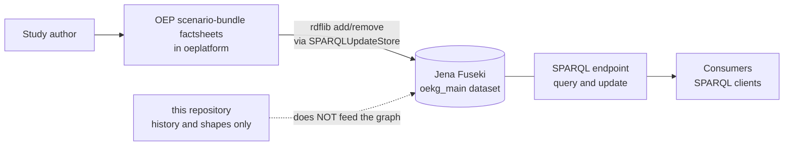

---
hide:
  - footer
---

# OEKG — Open Energy Knowledge Graph

The OEKG describes **energy studies and scenarios** in a structured, machine-readable way, so
that studies can be compared rather than merely read. It uses the
[Open Energy Ontology](https://github.com/OpenEnergyPlatform/ontology) as its schema and RDF as
its data model.

Its purpose is comparison: sector divisions, energy carriers, spatial regions, scenario years and
model frameworks expressed as a graph instead of as prose, so that questions can be asked across
studies at once.

| | |
|---|---|
| **Schema** | Open Energy Ontology (OEO) |
| **Data model** | RDF |
| **Store** | Jena Fuseki dataset |
| **Written by** | the Open Energy Platform's scenario-bundle factsheets |
| **Read by** | anyone, over [SPARQL](endpoint.md) |
| **Fields** | see [Factsheet fields](fields.md) |

## How the OEKG is populated

**That dotted arrow is deliberate, not unfinished.** This repository is not part of the path by
which the OEKG is written or read. Nothing here is loaded into the store, and no commit here
changes the graph. The platform writes triples over SPARQL directly; the only ontology file the
factsheet code parses is `oeo-full.owl`, which it takes from the platform's own ontology
directory rather than from here.

So if you are looking for the OEKG itself, you want the [SPARQL endpoint](endpoint.md). If you are
wondering why this repository contains Turtle files that are *not* the OEKG, that is
[provenance](provenance.md) — and it is the most common misunderstanding about this repository.

## What is in the repository, then

`oekg/` is organised **by status**, because the material spans three eras and conflating them is
exactly what caused the confusion above.

| Directory | Status | What it is |
|---|---|---|
| `oekg/shapes/` | current | the most developed SHACL shapes available. ⚠️ See the warning below. |
| `oekg/eval/` | current | competency questions in natural language and SPARQL, plus evaluation shapes |
| `oekg/legacy/` | **superseded** | the first population pipeline: placeholder JSON, a Colab notebook, a 2023 Turtle snapshot. Do not reuse. |
| `oekg/archive/madbkr_ba/` | **archived** | a finished Bachelor's thesis remodelling the graph, intact. Closed. |

Each directory has a README stating what it holds and whether it is live. Read it first.

### The shapes do not validate the live graph

⚠️ `oekg/shapes/` holds the best SHACL available here, and it is a reasonable starting point for
future work — but be clear about what it is not:

- It was authored against the **thesis-reworked** graph, not the live one.
- **No SHACL file in this repository describes the live graph.** All of them were written against
  dumps.
- It is on the **older namespace form** (`http://openenergy-platform.org/…`), while the live graph
  has since migrated to `https://openenergyplatform.org/…`. The competency-question SPARQL in
  `oekg/eval/` has the same issue.

So a query or validation run copied from here will not match the live graph until it is rebased.
That is a known open item, not a bug to be surprised by — see
[Tech stack](../tech-stack.md#what-is-still-open).

### Where the predicates are defined

`oekg/archive/madbkr_ba/scripts/documentation.pdf` gives **every predicate with its definition,
domain and range**. Despite living in an archive, it is the most useful reference in the
repository for understanding what an OEKG predicate means.
