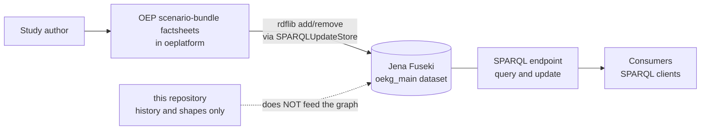

---
hide:
  - footer
---

# OEKG — Open Energy Knowledge Graph

The OEKG describes **energy studies and scenarios** in a structured, machine-readable way, so
that studies can be compared rather than merely read. It uses the
[Open Energy Ontology](https://github.com/OpenEnergyPlatform/ontology) as its schema and RDF as
its data model.

Its purpose is comparison: sector divisions, energy carriers, spatial regions, scenario years and
model frameworks expressed as a graph instead of as prose, so that questions can be asked across
studies at once.

| | |
|---|---|
| **Schema** | Open Energy Ontology (OEO) |
| **Data model** | RDF |
| **Store** | Jena Fuseki dataset |
| **Written by** | the Open Energy Platform's scenario-bundle factsheets |
| **Read by** | anyone, over [SPARQL](endpoint.md) |
| **Fields** | see [Factsheet fields](fields.md) |

## How the OEKG is populated

**That dotted arrow is deliberate, not unfinished.** This repository is not part of the path by
which the OEKG is written or read. Nothing here is loaded into the store, and no commit here
changes the graph. The platform writes triples over SPARQL directly; the only ontology file the
factsheet code parses is `oeo-full.owl`, which it takes from the platform's own ontology
directory rather than from here.

So if you are looking for the OEKG itself, you want the [SPARQL endpoint](endpoint.md). If you are
wondering why this repository contains Turtle files that are *not* the OEKG, that is
[provenance](provenance.md) — and it is the most common misunderstanding about this repository.

## What is in the repository, then

`oekg/` is organised **by status**, because the material spans three eras and conflating them is
exactly what caused the confusion above.

| Directory | Status | What it is |
|---|---|---|
| `oekg/shapes/` | current | `oekg_shapes.ttl`, the OEKG's canonical SHACL shapes. They **do** describe the live graph — see below. |
| `oekg/eval/` | current | competency questions in natural language and SPARQL |
| `oekg/legacy/` | **superseded** | the first population pipeline: placeholder JSON, a Colab notebook, a 2023 Turtle snapshot. Do not reuse. |
| `oekg/archive/madbkr_ba/` | **archived** | a finished Bachelor's thesis remodelling the graph, intact. Closed. |

Each directory has a README stating what it holds and whether it is live. Read it first.

### The shapes describe the live graph — as of 2026-08-13

**This section previously said the opposite, and that is worth explaining rather than quietly
editing.** Until 2026-08-13 `oekg/shapes/` held the thesis's **pre-rework** shapes: written against
the graph *before* the remodelling, on the old `http://openenergy-platform.org/…` namespace. Against
today's graph that file matches nothing at all, so "the shapes do not validate the live graph" was
true of the file that happened to be sitting there — not of the shapes that existed.

The thesis's **final** shapes were in `oekg/eval/`, described there as mere "evaluation material".
They have been moved to `oekg/shapes/oekg_shapes.ttl` and are now the canonical file.

Validated 2026-08-13 with `pyshacl` against a dump of the live graph:

- **They bind.** 1,499 focus nodes across all eight shapes; the declared namespaces match the live
  graph exactly. (A shapes file whose namespaces do not match reports `Conforms: True` by matching
  nothing — that is precisely what the old file did.)
- **135 violations**, 0.99% of 13,700 triples, against the thesis's own baseline of 55 / 0.5%.
- **133 of those 135 are `oeplatform` data bugs** — unfilled mandatory fields, missing OEO term
  labels, and writer regressions — which no change to this repository can fix. Only 2 are the
  shapes' own.

Two caveats remain. The run used a **dump, not the SPARQL endpoint**, so the dump-vs-live gap is
unmeasured. And the **competency-question SPARQL in `oekg/eval/` still carries the old namespace**
(`http://openenergy-platform.org/ontology/oekg/`), so a query copied from there will not match the
live graph until it is rebased — see [Tech stack](../tech-stack.md#what-is-still-open).

### Where the predicates are defined

`oekg/archive/madbkr_ba/scripts/documentation.pdf` gives **every predicate with its definition,
domain and range**. Despite living in an archive, it is the most useful reference in the
repository for understanding what an OEKG predicate means.
