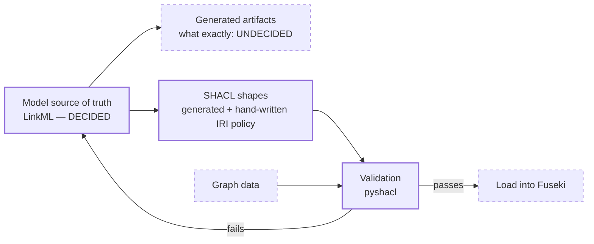

---
hide:
  - footer
---

# Tech stack

What these two knowledge graphs are built with — and, just as importantly, **which parts are not
decided yet**. Anything below marked *open* is genuinely open; nothing here should be read as a
commitment that has not been made.

## Settled

| Concern | Choice | Notes |
|---|---|---|
| Data model | **RDF** | both graphs |
| Serialisation | **Turtle** for the OEKG, **RDF/XML** for the MHP draft | the MHP draft's format is an artefact of its export tool, not a decision |
| Triple store | **Apache Jena Fuseki** | the OEKG is served from a Fuseki dataset |
| Query protocol | **SPARQL** | see [the endpoint](oekg/endpoint.md) |
| OEKG schema | **[Open Energy Ontology](https://github.com/OpenEnergyPlatform/ontology)** (OEO) | |
| MHP schema | **[MHPO](https://github.com/OpenEnergyPlatform/municipal-heat-planning-ontology)** | imports from and aligns to OEO |
| Graph manipulation | **[`rdflib`](https://github.com/RDFLib/rdflib)** | also how the platform writes to the store |
| SHACL validation | **[`pyshacl`](https://github.com/RDFLib/pySHACL)** | works; but see the warning below about *what* it validates |
| Documentation | **mkdocs** + **mkdocs-material** | this site |

## The repositories

Four repositories are in play, and knowing which owns what saves a lot of confusion:

| Repository | Owns |
|---|---|
| **`oekg`** (this one) | both graphs' data, shapes and documentation |
| [`ontology`](https://github.com/OpenEnergyPlatform/ontology) | the Open Energy Ontology |
| [`municipal-heat-planning-ontology`](https://github.com/OpenEnergyPlatform/municipal-heat-planning-ontology) | MHPO |
| [`municipal-heat-planning-pdf-processing`](https://github.com/OpenEnergyPlatform/municipal-heat-planning-pdf-processing) | the RAG pipeline over published heat plans |
| [`oeplatform`](https://github.com/OpenEnergyPlatform/oeplatform) | the Open Energy Platform — **consumer and writer** of the OEKG, via factsheets |

Note the direction of that last row: `oeplatform` **writes** the OEKG over SPARQL. It does not read
files from this repository. See [how the OEKG is populated](oekg/index.md#how-the-oekg-is-populated).

## Versions

| | |
|---|---|
| OEO release vendored in the archive | **v2.8.0** (`oekg/archive/madbkr_ba/oekg_rework/oeo-full.owl`) |
| OEO release the live graph targets | tracks the current OEO; not pinned here |

The vendored copy exists to keep the archived thesis self-contained. It is **not** the version to
work from — take OEO releases from the
[`ontology`](https://github.com/OpenEnergyPlatform/ontology) repository.

## Dependencies and environment

Managed with **[uv](https://docs.astral.sh/uv/)**. `pyproject.toml` declares the dependency
groups, `uv.lock` pins the exact resolved versions, and `.python-version` pins the interpreter —
which uv downloads itself, so no system Python is required.

| File | Role |
|---|---|
| `pyproject.toml` | dependency groups; `package = false` (this repo is not an importable package) |
| `uv.lock` | **committed** — the exact resolved set, so CI installs what you have locally |
| `.python-version` | the interpreter uv fetches (3.13); `requires-python` is `>=3.11` |

The commands a contributor runs live in
[CONTRIBUTING.md](https://github.com/OpenEnergyPlatform/oekg/blob/production/CONTRIBUTING.md#local-setup),
deliberately in **one** place rather than copied here — two copies of setup instructions diverge
within months. That page also lists the traps, including the fact that the dev server does not
serve at `/`.

There are three groups: **`docs`** (the documentation build), **`schema`** (LinkML, which generates
the SHACL shapes) and **`graph`** (`pyshacl` and `rdflib`). `schema` and `graph` are separate
because `linkml` accounts for 88 of the 95 packages they resolve to between them, and a job that
only validates has no reason to install a generator.

Pull-request checks run `uv lock --check`, which **fails** if `uv.lock` is out of step with
`pyproject.toml`, then install every group and build the documentation with `--strict`. The deploy
workflow installs with `--locked`, which fails the same way.

!!! warning "`--frozen` does not assert anything — corrected 2026-08-07"

    This page and `CONTRIBUTING.md` both used to state that CI enforced the lockfile with
    `--frozen`. That was **wrong**, and the guarantee it described did not exist: `--frozen` means
    *"sync without updating the lockfile"*, so it accepts a stale lock and exits 0. Verified by
    running `uv sync --group docs --frozen` against a `pyproject.toml` carrying a dependency group
    absent from `uv.lock` — it passed. The flags that actually assert are `--locked` and
    `uv lock --check`, and both are now in use. Compounding it, the deploy workflow does not run on
    pull requests at all, so nothing checked anything before merge; that is what `checks.yml` is
    for.

!!! note "This diverges from the rest of the Open Energy Family"

    Other OEP repositories use a plain `requirements.txt` with `pip`. This one deliberately does
    not. The trade was made knowingly: a single source of truth plus a real lockfile was judged
    worth more than byte-for-byte consistency with a 15-line workflow. If you maintain other family
    repos, this is the one place this repo will surprise you.

!!! warning "The archived thesis scripts are still not reproducible"

    `oekg/archive/madbkr_ba/scripts/` was written against unrecorded versions of `rdflib` and
    `owlready2`, needs a Java toolchain for `sync_reasoner()`, and one script raises `TypeError` on
    every invocation. **It is closed work**; the archive makes no reproducibility claim. The
    `graph` group now locks an `rdflib` — but it locks it for *new* work, not for these scripts,
    and it does not lock `owlready2` or provide Java. Nothing here resurrects them.

## What is still open

Model-design questions rather than repository-structure ones, worked as a separate effort. The
first of them has since been **decided** and is kept here, marked as such, so that anyone who read
the old text sees what changed rather than finding the section quietly gone.

### The model source of truth

**Decided** (2026-08-07), and no longer "under consideration". [LinkML](https://linkml.io/) is the
authoring layer: one schema definition generates the SHACL shapes that validate the data. LinkML
**never mints domain terms** — every class and slot points at an IRI owned by the
[municipal heat planning ontology](https://github.com/OpenEnergyPlatform/municipal-heat-planning-ontology)
(MHPO) or by OEO — and OWL generation stays off, so it never competes with MHPO as a source of
terms.

✅ **A first slice of that schema now exists** — `mhpkg/schema/`, covering a municipal heat plan, its
target scenario and one final energy consumption value, with the SHACL generated from it and both a
conformant and a deliberately failing example. It was built to test the decision against a real
OBO-style ontology rather than to cover the domain, and the decision held: `gen-shacl` puts each
`class_uri` straight into `sh:targetClass`, so the generated shapes constrain MHPO and OEO IRIs
directly.

Two limits found while building it are worth knowing before relying on the approach, and both are
documented in `mhpkg/schema/README.md`:

- **The IRI policy cannot be generated.** SHACL constrains a node's own IRI with `sh:pattern` at
  *node* level and LinkML cannot emit that, so one hand-written shapes file sits alongside the
  generated one. "Everything is generated" is not achievable today.
- **Generated SHACL is not byte-stable**, because every `sh:property` is a blank node. A drift check
  has to compare graphs, not bytes — a `diff` would fail on every run while nothing was wrong.

### What validates what

Describes the **live OEKG**, verified 2026-08-13:

- `oekg/shapes/oekg_shapes.ttl` — the OEKG's canonical shapes. Run against a dump of the live graph
  they bind 1,499 focus nodes across all eight shapes and report 135 violations (0.99% of triples),
  **133 of which are `oeplatform` data bugs** rather than anything this repository can fix.

⚠️ **This entry used to say the opposite.** Until 2026-08-13 `oekg/shapes/` held the thesis's
*pre-rework* file, which declares the OEO prefix as `http://openenergy-platform.org/ontology/oeo/`
and uses readable property names like `oeo:covers_energy_carrier` that OEO does not define. The
namespace resolves — it redirects — but an IRI is *identity, not an address*, so every term in it is
a different term from the one OEO mints, and it therefore could not match the live graph even in
principle. That file is now only in the archive; the canonical file uses the current
`https://openenergyplatform.org/…` namespaces.

Describes a dump or a target state, not the store:

- the archive's own copies — thesis provenance, both the 350-line and 317-line instruments
- `oekg/eval/competency_questions/` — the SPARQL still carries the **old** `oekg` namespace and
  needs rebasing before it will match the live graph

Authored against the schema, and exercised on every run of `mhpkg/schema/validate.py`:

- `mhpkg/schema/generated/` — generated from the LinkML schema
- `mhpkg/schema/mhpkg_iri_policy.shacl.ttl` — hand-written, enforcing the IRI policy

So `pyshacl` "working" now means two different things. For MHPKG: example data is checked in both
directions — the conformant instance passes and the negative control is asserted to fail for each of
its reasons. For the OEKG: the shapes have been run against real graph data once, by hand, and the
result recorded. Neither is **a validation pipeline or a CI job** — `checks.yml` still validates no
graph data at all.

### Namespace migration

The project has moved from `http://openenergy-platform.org/…` to
`https://openenergyplatform.org/…`. **The live graph has been updated. Some files here have not** —
notably `oekg/shapes/` and the competency-question SPARQL in `oekg/eval/`.

This matters practically: a query or shapes file copied from those locations may silently return
nothing against the live graph, because a zero-result SPARQL query is indistinguishable from a
correct query about absent data. Files under `oekg/legacy/` and `oekg/archive/` use the old form
**correctly** — they are dated artefacts and should not be changed.

### Where the heat-planning graph will be hosted

**Undecided.** Either a second dataset in the Fuseki store that already serves the OEKG, or a
separate instance. Access, backup and governance ride on the answer.

### The graph / table boundary

**Undecided.** Which extracted heat-plan data belongs in the graph as triples, and which is better
served as a table on the Open Energy Platform. See [Workflow](workflow.md#not-everything-belongs-in-a-graph).

## The modelling and build workflow — the first steps built

!!! warning "The left of this diagram is real; the right is still intention"

    **The authoring end now exists** — a LinkML schema, the SHACL generated from it, and validation
    of example data in both directions. Solid boxes below are built and exercised.

    **Nothing has been loaded into a triple store yet**, and there is no CI job. Dashed boxes are
    not built. The boxes still marked *undecided* are the open questions listed above.

    When a decision is made, the marker here should be replaced by the answer rather than left to
    rot.



The shape of it is not controversial — author a model, generate from it, validate data against it,
load what passes. **The leftmost box is now answered**: LinkML authors the model, MHPO owns the
terms. What remains open is *which* generated artifacts are authoritative and how they are published
— and one finding from building the schema constrains that answer already, because the IRI policy
has to be hand-written, so the contract cannot simply say "everything is generated".

## Documentation and CI

| | |
|---|---|
| Site generator | mkdocs **1.x** with mkdocs-material |
| Diagrams | mermaid, via Material's `pymdownx.superfences` custom fence |
| Build strictness | `strict: true` **plus** an explicit `validation:` block |
| Hosting | GitHub Pages |

!!! warning "The `mkdocs~=1.6` pin is deliberate — do not relax it to allow 2.0"

    The Material for MkDocs team warns that **MkDocs 2.0** introduces backward-incompatible
    changes to the framework Material is built on: the plugin system is removed (all plugins stop
    working), the theming system is rewritten (all overrides break), **no migration path exists**,
    the contribution model is closed, and it is **currently unlicensed — unsuitable for production
    use**. Material itself is not deprecated; it is actively maintained and Production/Stable.

    `mkdocs~=1.6` resolves to `>=1.6, ==1.*`, which permits 1.9 but **blocks 2.0** — verified. Keep
    it that way until the situation upstream resolves. See the
    [Material team's analysis](https://squidfunk.github.io/mkdocs-material/blog/2026/02/18/mkdocs-2.0/).

### Why the `validation:` block exists

`strict: true` alone is **not** enough. mkdocs 1.6 does not check `#anchors` by default, so a
strict build passes happily while cross-page anchor links rot. These pages carry several such
links, so the config adds:

```yaml
validation:
  anchors: warn
  unrecognized_links: warn
  absolute_links: warn
```

With `strict: true`, a warning becomes a build failure. This was verified with a negative control —
an anchor was deliberately broken and the build aborted with exit 1 — so the passing build is a
real result and not a disabled check.

Documentation is the **only** thing this repository has CI for. There is no test suite and no
validation job; adding SHACL validation to CI is an obvious future step, but it depends on the
model source of truth above being decided first.
