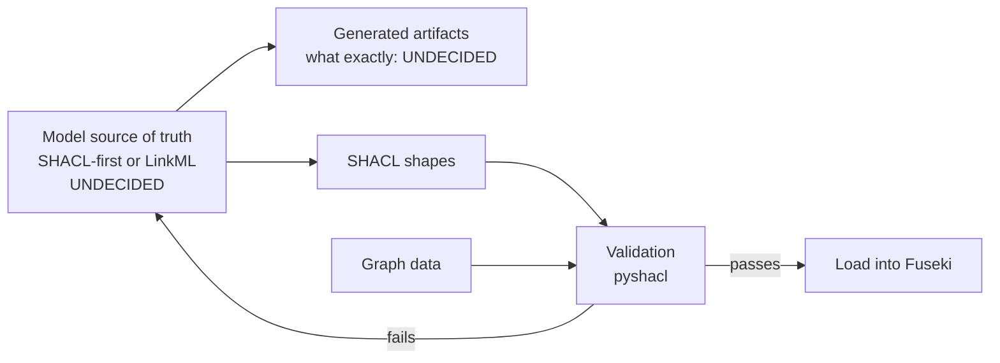

---
hide:
  - footer
---

# Tech stack

What these two knowledge graphs are built with — and, just as importantly, **which parts are not
decided yet**. Anything below marked *open* is genuinely open; nothing here should be read as a
commitment that has not been made.

## Settled

| Concern | Choice | Notes |
|---|---|---|
| Data model | **RDF** | both graphs |
| Serialisation | **Turtle** for the OEKG, **RDF/XML** for the MHP draft | the MHP draft's format is an artefact of its export tool, not a decision |
| Triple store | **Apache Jena Fuseki** | the OEKG is served from a Fuseki dataset |
| Query protocol | **SPARQL** | see [the endpoint](oekg/endpoint.md) |
| OEKG schema | **[Open Energy Ontology](https://github.com/OpenEnergyPlatform/ontology)** (OEO) | |
| MHP schema | **[MHPO](https://github.com/OpenEnergyPlatform/municipal-heat-planning-ontology)** | imports from and aligns to OEO |
| Graph manipulation | **[`rdflib`](https://github.com/RDFLib/rdflib)** | also how the platform writes to the store |
| SHACL validation | **[`pyshacl`](https://github.com/RDFLib/pySHACL)** | works; but see the warning below about *what* it validates |
| Documentation | **mkdocs** + **mkdocs-material** | this site |

## The repositories

Four repositories are in play, and knowing which owns what saves a lot of confusion:

| Repository | Owns |
|---|---|
| **`oekg`** (this one) | both graphs' data, shapes and documentation |
| [`ontology`](https://github.com/OpenEnergyPlatform/ontology) | the Open Energy Ontology |
| [`municipal-heat-planning-ontology`](https://github.com/OpenEnergyPlatform/municipal-heat-planning-ontology) | MHPO |
| [`municipal-heat-planning-pdf-processing`](https://github.com/OpenEnergyPlatform/municipal-heat-planning-pdf-processing) | the RAG pipeline over published heat plans |
| [`oeplatform`](https://github.com/OpenEnergyPlatform/oeplatform) | the Open Energy Platform — **consumer and writer** of the OEKG, via factsheets |

Note the direction of that last row: `oeplatform` **writes** the OEKG over SPARQL. It does not read
files from this repository. See [how the OEKG is populated](oekg/index.md#how-the-oekg-is-populated).

## Versions

| | |
|---|---|
| OEO release vendored in the archive | **v2.8.0** (`oekg/archive/madbkr_ba/oekg_rework/oeo-full.owl`) |
| OEO release the live graph targets | tracks the current OEO; not pinned here |

The vendored copy exists to keep the archived thesis self-contained. It is **not** the version to
work from — take OEO releases from the
[`ontology`](https://github.com/OpenEnergyPlatform/ontology) repository.

!!! note "This repository pins no dependencies"

    There is no `requirements.txt`, `pyproject.toml` or lockfile for the graph tooling — only the
    documentation build has pinned dependencies. The archived thesis scripts therefore cannot be
    guaranteed to run, and the archive makes no reproducibility claim.

## What is still open

These are the decisions that have **not** been made. They are being worked as a separate effort,
because they are model-design questions rather than repository-structure ones.

### The model source of truth

**Undecided.** The intended direction is **SHACL-shapes-first**: define the shapes, validate
against them, and generate whatever else is needed from them — so that the model has one
authoritative definition and validation is guaranteed rather than hoped for.
[LinkML](https://linkml.io/) is under consideration as the authoring layer to generate from.

Neither is settled, and **nothing in this repository currently implements either.**

### What validates what

⚠️ **No SHACL file in this repository validates any live graph.** Every one of them was authored
against a dump:

- `oekg/shapes/` — the most developed shapes available, written against the thesis-reworked graph
- `oekg/eval/oekg_shacl.txt` — evaluation shapes for the same era
- the archive's own copies — thesis provenance

So `pyshacl` "working" does not mean there is a validation pipeline. There is not one yet.

### Namespace migration

The project has moved from `http://openenergy-platform.org/…` to
`https://openenergyplatform.org/…`. **The live graph has been updated. Some files here have not** —
notably `oekg/shapes/` and the competency-question SPARQL in `oekg/eval/`.

This matters practically: a query or shapes file copied from those locations may silently return
nothing against the live graph, because a zero-result SPARQL query is indistinguishable from a
correct query about absent data. Files under `oekg/legacy/` and `oekg/archive/` use the old form
**correctly** — they are dated artefacts and should not be changed.

### Where the heat-planning graph will be hosted

**Undecided.** Either a second dataset in the Fuseki store that already serves the OEKG, or a
separate instance. Access, backup and governance ride on the answer.

### The graph / table boundary

**Undecided.** Which extracted heat-plan data belongs in the graph as triples, and which is better
served as a table on the Open Energy Platform. See [Workflow](workflow.md#not-everything-belongs-in-a-graph).

## The modelling and build workflow — planned, not built

!!! danger "This diagram describes an intention, not reality"

    **None of the pipeline below exists today.** It is drawn to make the open decisions visible and
    to give the shapes-first work a starting point to argue with — not to record an agreed design.
    The boxes marked *undecided* are the actual open questions listed above.

    Do not treat this as the agreed pipeline. When a decision is made, the marker in this diagram
    should be replaced by the answer.

The shape of it is not controversial — author a model, generate from it, validate data against it,
load what passes. What is undecided is **what the leftmost box actually is**, and that determines
everything downstream.

## Documentation and CI

| | |
|---|---|
| Site generator | mkdocs with mkdocs-material |
| Diagrams | mermaid, via Material's `pymdownx.superfences` custom fence |
| Build strictness | `strict: true` — a broken internal link fails the build |
| Hosting | GitHub Pages |

Documentation is the **only** thing this repository has CI for. There is no test suite and no
validation job; adding SHACL validation to CI is an obvious future step, but it depends on the
model source of truth above being decided first.
