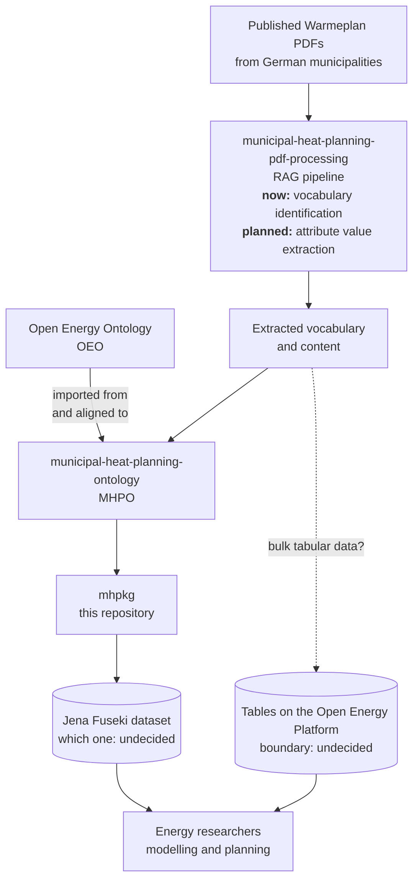

---
hide:
  - footer
---

# Workflow — from published heat plans to queryable data

This page describes the **municipal heat planning** pipeline: how a PDF published by a German
municipality becomes structured, queryable data. It spans four repositories.

For the OEKG's own, quite different workflow — authored on the platform rather than extracted
from documents — see [how the OEKG is populated](oekg/index.md#how-the-oekg-is-populated).

## The pipeline

## Reading the diagram

**Two boxes say *undecided*, and one arrow is a question mark. Those are real open questions, not
gaps in the drawing.** A diagram that quietly invented answers would be worse than one that
admits them.

### The RAG pipeline does not yet extract values

Today the pipeline in
[municipal-heat-planning-pdf-processing](https://github.com/OpenEnergyPlatform/municipal-heat-planning-pdf-processing)
runs with the goal of **identifying the vocabulary** used across published heat plans — what
concepts appear, and how they are named. Extracting *actual values* for specific attributes is
the intended next step, not a current capability.

This distinction matters more than it might look. The research interest in this work is
overwhelmingly in the values — real figures per municipality that planning and modelling work can
build on. Anyone reading this diagram should not assume that data exists yet.

### The ontology is developed separately, and draws on OEO

[MHPO](https://github.com/OpenEnergyPlatform/municipal-heat-planning-ontology) is its own
project. It both imports from and aligns to the
[Open Energy Ontology](https://github.com/OpenEnergyPlatform/ontology), which is where a good
deal of the necessary energy-domain terminology already exists. This repository **uses** MHPO; it
does not define it.

### Not everything belongs in a graph

Some of what the heat plans contain is naturally tabular — long series of figures per
municipality, per year, per technology. Triples are a poor fit for that, and the Open Energy
Platform already serves tables well.

**Where that boundary falls is not yet decided.** Until it is, bulk tabular extractions are
flagged rather than committed to the graph, so that the decision gets made deliberately instead
of by accident. See [Tech stack](tech-stack.md#what-is-still-open).

### Which Fuseki dataset

The Open Energy Platform already runs a Jena Fuseki store serving the OEKG. Whether the
heat-planning graph becomes a second **dataset** in that same store, or gets its own instance, is
an open hosting question with access, backup and governance attached to it.

## What this repository contributes

Only the box labelled `mhpkg`. The pipeline's other stages live in their own repositories, and
this repository deliberately does not vendor them:

| Stage | Where it lives |
|---|---|
| PDF processing, RAG | [municipal-heat-planning-pdf-processing](https://github.com/OpenEnergyPlatform/municipal-heat-planning-pdf-processing) |
| The ontology | [municipal-heat-planning-ontology](https://github.com/OpenEnergyPlatform/municipal-heat-planning-ontology) |
| Energy-domain terminology | [Open Energy Ontology](https://github.com/OpenEnergyPlatform/ontology) |
| The graph | this repository, `mhpkg/` |
| Serving and consumption | Jena Fuseki, the Open Energy Platform |

The source PDFs are **not** vendored either — they are published documents and are referenced,
not copied.
